# 🚀 AI-Driven Self-Healing DevOps Platform on AWS

> Enterprise-grade cloud-native DevOps + AIOps platform engineered using AWS, Terraform, Docker, GitHub Actions, CloudWatch, SNS, and Python-based self-healing automation.

<p align="center">
  
  
  
  
  
  
</p>

---

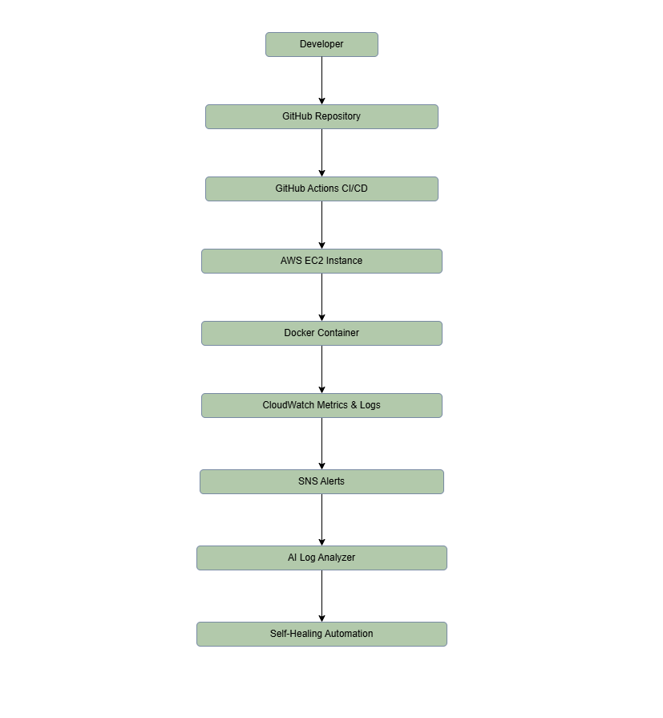

---

# 📌 Overview

This project simulates a production-grade cloud-native DevOps + AIOps environment focused on automation, observability, operational reliability, CI/CD engineering, monitoring, and self-healing remediation.

The platform provisions AWS infrastructure using Terraform, deploys Dockerised workloads on EC2, automates deployments through GitHub Actions, monitors workloads using CloudWatch, aggregates logs centrally, triggers SNS alerts, and performs AI-inspired anomaly detection with automated container recovery.

Unlike traditional beginner DevOps projects, this platform focuses heavily on:

* Infrastructure as Code
* Deployment automation
* Production-style observability
* Monitoring engineering
* Operational troubleshooting
* Automated remediation
* Cloud-native reliability workflows

The complete infrastructure, deployment workflow, monitoring stack, and remediation logic were manually engineered and integrated into a single production-style DevOps platform.

---

# 🔥 Why This Project Stands Out

✅ Fully automated Infrastructure as Code using Terraform
✅ Production-style Docker deployment on AWS EC2
✅ End-to-end CI/CD automation using GitHub Actions
✅ Cloud-native monitoring and observability using CloudWatch
✅ SNS-powered real-time incident alerting
✅ AI-inspired log anomaly detection using Python
✅ Self-healing container remediation workflow
✅ Real-world debugging, troubleshooting, and operational recovery
✅ Infrastructure, deployment, monitoring, and remediation integrated into a single platform

---

# 🧠 System Architecture

The following architecture demonstrates the complete DevOps lifecycle implemented in this platform including infrastructure provisioning, CI/CD automation, observability, monitoring, alerting, AI-driven anomaly detection, and self-healing remediation.


### Architecture Workflow

```text
Developer
    ↓
GitHub Repository
    ↓
GitHub Actions CI/CD
    ↓
Terraform Infrastructure Provisioning
    ↓
AWS EC2 Instance
    ↓
Docker Containerised Application
    ↓
CloudWatch Metrics & Logs
    ↓
SNS Alerts
    ↓
AI Log Analyzer
    ↓
Self-Healing Automation
```

---

# ⚡ Core Capabilities

| Capability                  | Implementation                   |
| --------------------------- | -------------------------------- |
| Infrastructure Provisioning | Terraform                        |
| Cloud Platform              | AWS                              |
| Containerisation            | Docker                           |
| CI/CD Automation            | GitHub Actions                   |
| Monitoring                  | CloudWatch                       |
| Alerting                    | SNS                              |
| Observability               | CloudWatch Metrics + Logs        |
| AI Log Analysis             | Python-based anomaly detection   |
| Self-Healing                | Automatic container restart      |
| Security                    | GitHub Secrets + Security Groups |

---

# 🛠 Tech Stack

| Category               | Technologies   |
| ---------------------- | -------------- |
| Cloud Platform         | AWS            |
| Infrastructure as Code | Terraform      |
| Containerisation       | Docker         |
| CI/CD                  | GitHub Actions |
| Monitoring             | CloudWatch     |
| Alerting               | SNS            |
| Programming            | Python         |
| Operating System       | Ubuntu Linux   |
| Web Server             | NGINX          |

---

# 📁 Project Structure

```text
aws-terraform-devops/
│
├── .github/
│   └── workflows/
│       └── docker.yml
│
├── app/
│   ├── Dockerfile
│   └── index.html
│
├── ai-monitor/
│   └── ai_log_analyzer.py
│
├── images/
│   ├── infrastructure/
│   ├── cicd/
│   ├── monitoring/
│   └── ai/
│
├── main.tf
├── provider.tf
├── .gitignore
└── README.md
```

---

# 🏗 Infrastructure Deployment

The infrastructure layer was provisioned entirely using Terraform following production-style networking and security practices.

## 🖥 EC2 Instance

Terraform-provisioned Ubuntu EC2 instance hosting the Dockerised application and monitoring stack.

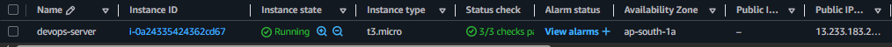

---

## 🌐 Custom VPC

Custom VPC configured for isolated cloud networking and secure infrastructure segmentation.

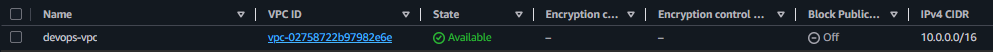

---

## 📡 Public Subnet

Public subnet configured to expose the application securely to the internet.

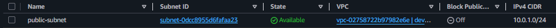

---

## 🛣 Route Table

Route table configured with internet gateway routing for external connectivity.

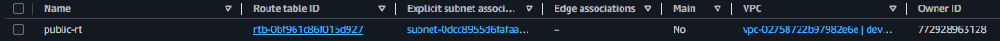

---

## 🔐 Security Group

Security group configured with controlled inbound access for SSH, HTTP, and application traffic.

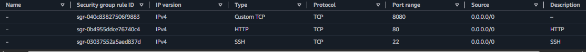

---

# 🔄 CI/CD Pipeline

The CI/CD layer automatically builds, deploys, and updates the Dockerised application on AWS EC2 whenever changes are pushed to the GitHub repository.

## ⚙ GitHub Actions Workflow

Automated CI/CD workflow responsible for deployment automation and Docker-based application delivery.

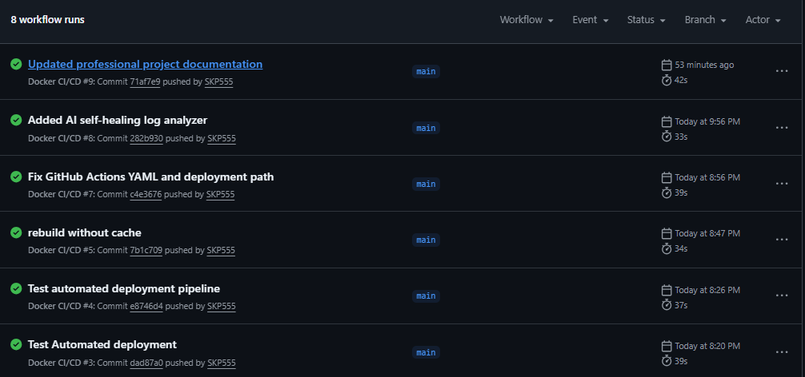

---

## 🚀 Deployment Workflow Execution

Workflow execution including SCP transfer, SSH deployment, Docker image rebuild, and container restart automation.

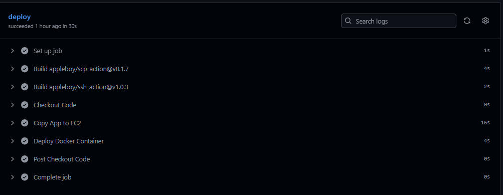

---

# 📊 Monitoring & Observability

CloudWatch monitoring and observability workflows were implemented to provide real-time visibility into infrastructure health, operational metrics, alarms, and centralised Docker logs.

## 📈 CloudWatch Metrics

Custom CloudWatch namespace collecting infrastructure and application metrics.

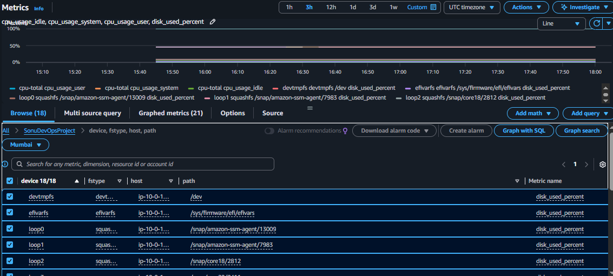

---

## 🚨 CloudWatch Alarm

Automated CPU threshold alarm configured for operational monitoring and incident detection.

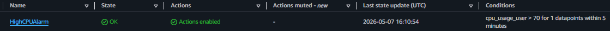

---

## 📜 Centralised Docker Logging

Docker container logs aggregated into CloudWatch Logs for observability and troubleshooting.

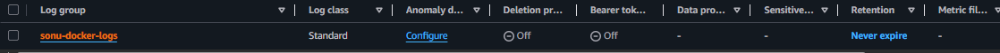

---

# 🤖 AI-Driven Self-Healing Automation

A Python-based AI-style anomaly detection engine continuously analyses container logs, detects operational failures, and automatically performs self-healing remediation.

## 🧠 AI Log Detection

Runtime anomaly detection using pattern-based operational analysis.

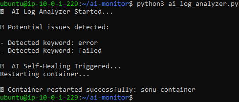

---

## 🌍 Live Running Application

Live Dockerised application deployed on AWS EC2 using automated CI/CD workflows.

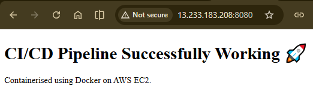

---

# 🧩 Challenges Faced & Solutions Implemented

| Challenge                                            | Resolution                                                         |
| ---------------------------------------------------- | ------------------------------------------------------------------ |
| Terraform VPC accidentally deleted manually from AWS | Rebuilt infrastructure cleanly using Terraform state management    |
| Invalid AWS AMI ID during EC2 provisioning           | Updated to region-supported Ubuntu AMI                             |
| SSH authentication failure while connecting to EC2   | Corrected SSH username and fixed PEM permissions using `chmod 400` |
| Website inaccessible publicly                        | Configured Security Group rules for HTTP and application ports     |
| GitHub Actions deployment failure                    | Debugged YAML syntax and corrected deployment workflow             |
| Docker changes not reflecting after deployment       | Resolved Docker caching using `--no-cache` rebuild strategy        |
| CloudWatch metrics not appearing                     | Attached proper IAM Role with CloudWatchAgentServerPolicy          |
| CloudWatch Agent initially not configured            | Created and validated custom CloudWatch Agent configuration        |
| AI analyzer detecting system-level noise             | Refined operational log analysis workflow and detection patterns   |

---

# 🔐 Security Best Practices Implemented

* Used GitHub Secrets for secure SSH authentication
* Ignored Terraform state files using `.gitignore`
* Restricted infrastructure access through Security Groups
* Implemented IAM Role-based CloudWatch access
* Isolated workloads inside custom VPC networking
* Followed infrastructure automation and deployment best practices

---

# 📚 Key Learning Outcomes

This project strengthened practical engineering knowledge across:

* AWS cloud infrastructure
* Infrastructure as Code with Terraform
* Docker containerisation
* Linux systems administration
* GitHub Actions CI/CD pipelines
* CloudWatch monitoring and observability
* SNS alerting systems
* Operational debugging and troubleshooting
* Python automation workflows
* AIOps and self-healing concepts
* Cloud-native operational reliability engineering

---

# 🚀 Business & Engineering Impact

This platform demonstrates practical experience across modern DevOps engineering domains including:

* Cloud infrastructure provisioning
* Deployment automation
* Monitoring and observability engineering
* Incident detection and remediation
* Infrastructure troubleshooting
* Operational reliability workflows
* Self-healing automation patterns

The project reflects production-style engineering workflows used in real cloud-native DevOps environments.

---

# 🎯 Final Result

Successfully built a production-style AI-driven DevOps platform capable of:

* Automated cloud infrastructure provisioning
* CI/CD-based Docker deployments
* Real-time monitoring and observability
* Centralised logging and alerting
* AI-inspired anomaly detection
* Automated self-healing remediation
* Cloud-native operational workflows

This project demonstrates hands-on experience with modern DevOps engineering, automation, observability, and operational reliability practices.

---

# 👨‍💻 Author

## Sonu Krishna

DevOps | Cloud | Automation | Observability | AIOps

* GitHub: [https://github.com/SKP555](https://github.com/SKP555)
* LinkedIn: [https://www.linkedin.com/in/sonukrsna](https://www.linkedin.com/in/sonukrsna)

---

# ⭐ Support

If you found this project interesting or useful, consider giving the repository a star.

